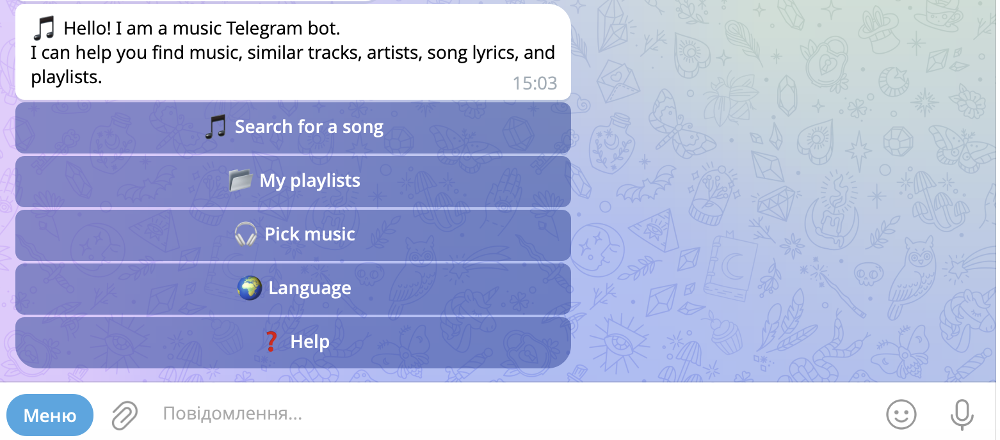

# Telegram Music Bot

A multilingual Telegram bot for finding music, sending audio tracks, discovering similar music, viewing lyrics, and organizing personal playlists. It also supports mood-based discovery through presets and optional AI intent classification.

> Status: Portfolio / educational project. This repository demonstrates API integration and bot UX; it is not a production music streaming service.

## Features

- Search for songs and artists through the YouTube Data API.
- Send selected audio tracks in Telegram using `yt-dlp`.
- Discover similar tracks and artists through Last.fm.
- View song lyrics through `syncedlyrics` / LRCLIB.
- Create playlists and save selected tracks.
- Pick music by mood or activity.
- Optional AI-assisted mood parsing with a keyword fallback.
- Ukrainian, Russian, and English localization.
- Inline menus, command menu, and paginated results.

## Screenshots

Add screenshots or a short demo GIF here:


- `docs/screenshots/track-actions.png`
- `docs/screenshots/mood-picker.png`

## Tech Stack

- Python 3.10+
- `python-telegram-bot`
- YouTube Data API (`google-api-python-client`)
- `yt-dlp`
- Last.fm API
- `syncedlyrics` / LRCLIB
- OpenAI Responses API (optional)
- Local JSON persistence for language preferences and playlists

## Project Structure

```text
telegram_music_bot/
|-- bot.py                       # Handlers, localization, player flow, storage
|-- keyboards.py                 # Inline keyboards and pagination controls
|-- ai_service.py                # Optional AI intent parser and keyword fallback
|-- lyrics_service.py            # Lyrics lookup and in-memory cache
|-- recommendations_service.py   # Last.fm recommendation integration
|-- requirements.txt             # Direct Python dependencies
|-- .env.example                 # Safe configuration template
|-- .gitignore                   # Ignored secrets and generated files
`-- README.md
```

At runtime the bot may create `languages.json`, `playlists.json`, and `saved.json`. They are ignored by Git because they contain user state.

## Installation

1. Clone the repository:

   ```bash
   git clone <repository-url>
   cd telegram_music_bot
   ```

2. Create and activate a virtual environment:

   ```bash
   python3 -m venv venv
   source venv/bin/activate
   ```

   On Windows:

   ```powershell
   py -m venv venv
   venv\Scripts\activate
   ```

3. Install requirements:

   ```bash
   pip install -r requirements.txt
   ```

## Environment Variables

Create a local configuration file from the safe template:

```bash
cp .env.example .env
```

Fill in your own values in `.env`:

```env
BOT_TOKEN=your_telegram_bot_token
YOUTUBE_API_KEY=your_youtube_api_key
LASTFM_API_KEY=your_lastfm_api_key
OPENAI_API_KEY=optional_openai_api_key
OPENAI_MODEL=gpt-4.1-mini
```

Required variables:

- `BOT_TOKEN`: Telegram bot token created through BotFather.
- `YOUTUBE_API_KEY`: YouTube Data API key used for search.
- `LASTFM_API_KEY`: Last.fm API key used for recommendations and mood-based discovery.

Optional variables:

- `OPENAI_API_KEY`: Enables AI parsing for free-text mood or activity requests. Without it, keyword matching is used.
- `OPENAI_MODEL`: Model used by optional AI parsing. Default: `gpt-4.1-mini`.

Important: never commit `.env` or publish actual API tokens. Only `.env.example` with placeholders belongs in the repository.

## Run Locally

With the virtual environment activated and `.env` configured:

```bash
python3 bot.py
```

Open the bot in Telegram and send `/start`.

## Hosting Notes

The bot runs by polling and can be hosted on a VPS, container platform, or worker service with secrets configured as protected environment variables.

Audio delivery depends on `yt-dlp` accessing YouTube. Cloud hosting providers may have blocked or rate-limited IP ranges, format availability may change, and YouTube behavior can change over time. Test downloads on the intended provider and comply with YouTube terms and applicable rights requirements.

## Security Checklist

- Store tokens only in local `.env` files or protected hosting variables.
- Do not commit generated user-state JSON files or downloaded audio.
- Rotate any credential that has ever appeared in Git history or public output.
